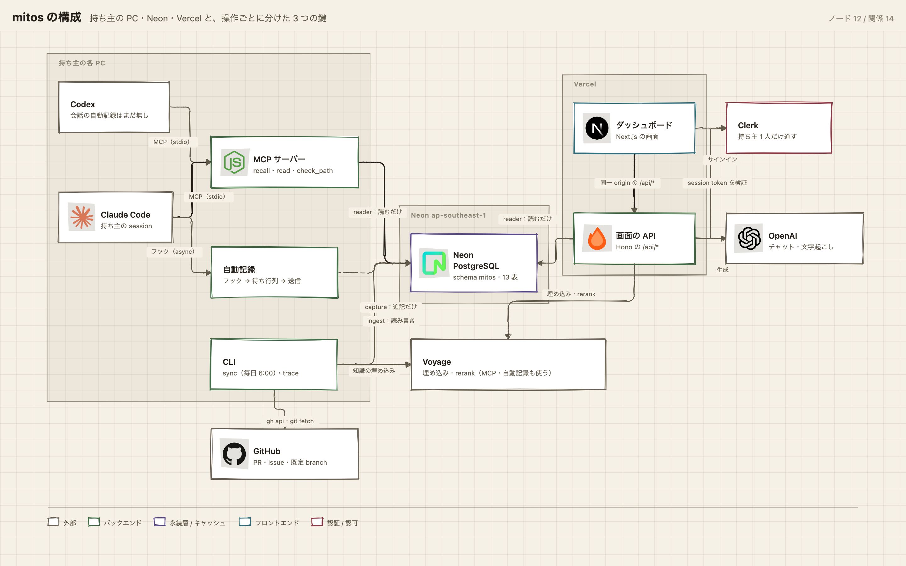
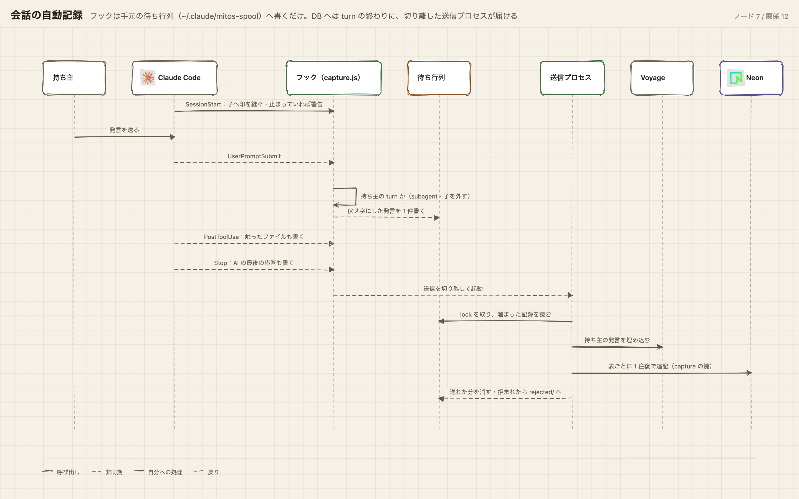
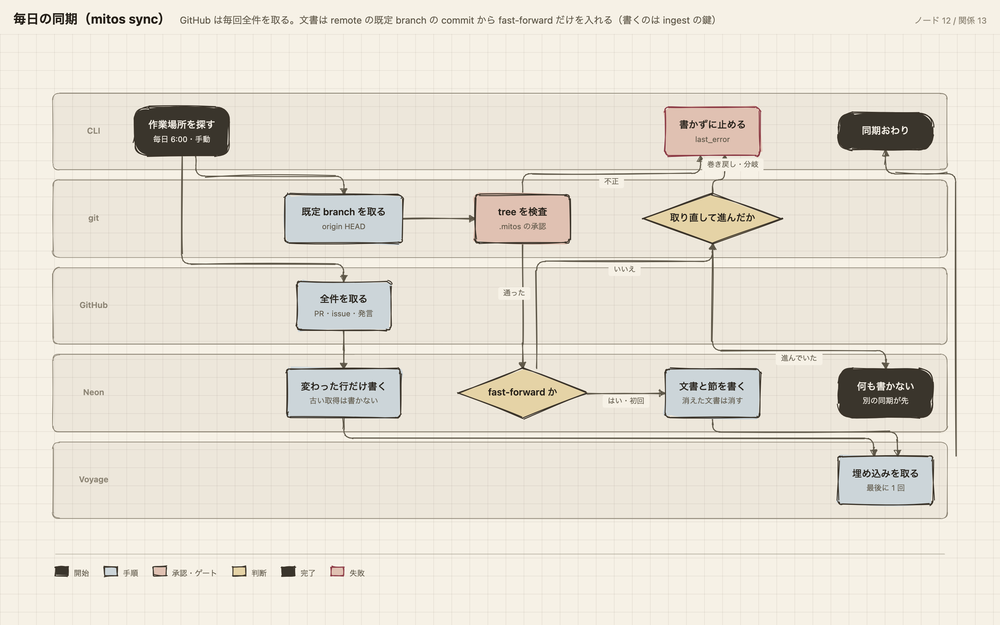
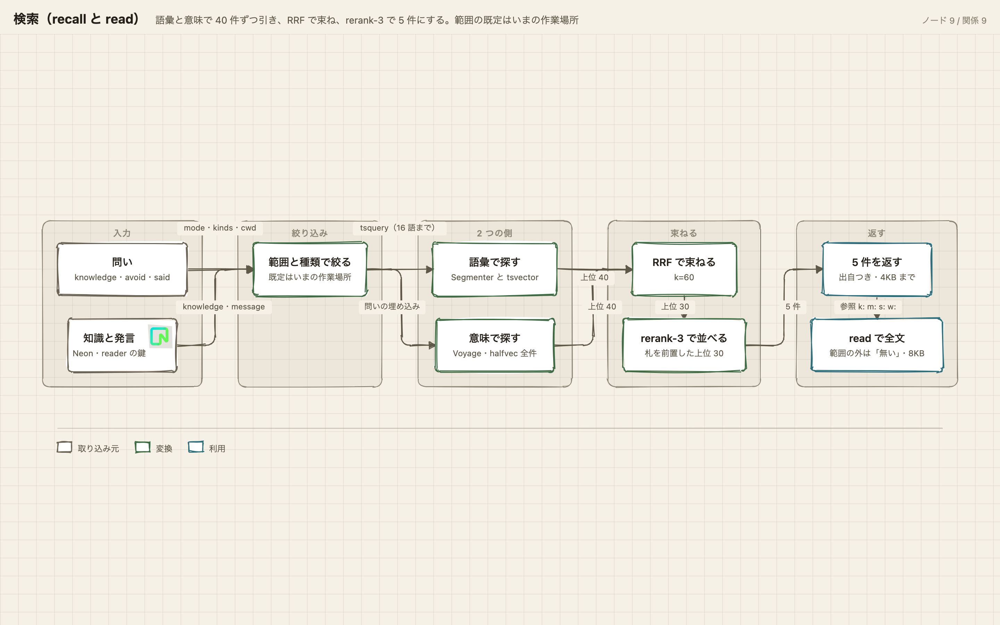
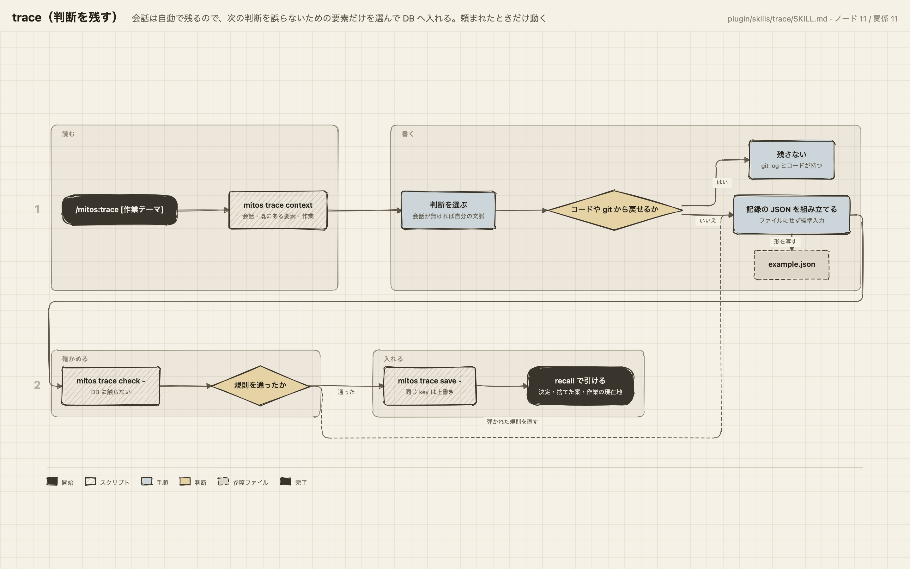

# mitos の流れの図

どれも `server/src` と `plugin/` の今の実装から起こした。PNG は一覧用で、HTML はブラウザで開くと
拡大・縮小と、読み筋（「引く」「残す」などのボタン）で経路だけを浮かせて読める。

## 全体の構成

持ち主の PC・Neon・Vercel と、操作ごとに分けた 3 つの鍵（reader・ingest・capture）。
[HTML](overview.html)



## 会話の自動記録

フックは手元の待ち行列へ書くだけで、DB へは turn の終わりに切り離した送信プロセスが届ける。
[HTML](capture.html)



## 毎日の同期（mitos sync）

GitHub は毎回全件を取り、文書は remote の既定 branch の commit から fast-forward だけを入れる。
巻き戻しと分岐は書かずに止める。[HTML](sync.html)



## 検索（recall と read）

語彙と意味で 40 件ずつ引き、RRF で束ね、rerank-3 で 5 件にする。範囲の既定はいまの作業場所。
[HTML](search.html)



## trace（判断を残す）

会話は自動で残るので、次の判断を誤らないための要素だけを選んで DB へ入れる。[HTML](trace.html)



## 描き直すとき

実装を変えて図と食い違ったら、`src/` の IR（atlas の入力）を直して描き直す。座標を書くのは
architecture だけで、ほかの型は並び順から配置が決まる。

```bash
A=~/.claude/skills/atlas/bin/atlas.mjs
node $A validate architecture src/overview.architecture.json   # 型は sequence / workflow / dataflow / skill も同じ
node $A render architecture src/overview.architecture.json overview.html
```

PNG は HTML の書き出しボタン（PNG）で取るか、1440 x 900 の窓で撮る。
